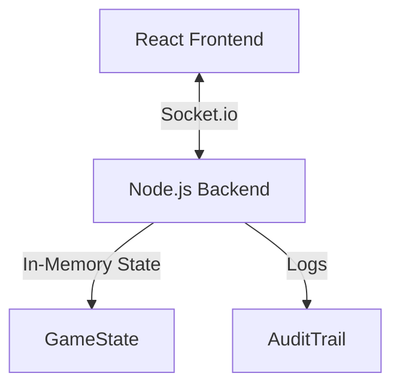

# SKY-MAGYCC JUDAS - The Judas Protocol

「SKY-MAGYCC JUDAS」は、世界経済を牛耳る超巨大テック企業「AETHER Global」を舞台にした、サイバーパンクな世界観の非対称対戦型マーダーミステリー・オンラインゲームです。

## 1. システムアーキテクチャ

本プロジェクトは、リアルタイム性と一貫性を重視したクライアント・サーバー構成を採用しています。

### アーキテクチャ図 (概要)


### アーキテクチャの特長
- **Authoritative Server**: 攻撃判定、AP計算、解析率の更新など、すべての重要ロジックをサーバー側で管理し、チートや不整合を防止しています。
- **Real-time Synchronization**: Socket.io による双方向通信により、フェーズの切り替え、タイマー、およびプレイヤー間の秘匿情報の通知をリアルタイムで行います。
- **Event-Driven UI**: クライアントはサーバーから送られてくる `GameState` のスナップショットを受け取り、React のステート駆動でUIを動的に更新します。

## 2. 技術スタック

### フロントエンド (nexus-war-app)
- **Framework**: React 18
- **Build Tool**: Vite
- **Language**: TypeScript
- **Styling**: Vanilla CSS (CSS変数を用いたテーマ管理, Glassmorphism)
- **Icons**: Lucide-react
- **Network**: Socket.io-client

### バックエンド (nexus-war-server)
- **Runtime**: Node.js (v20+)
- **Framework**: Express 5 (WebSocket 用)
- **WebSocket**: Socket.io
- **Development**: Nodemon, ts-node
- **Language**: TypeScript

## 3. ディレクトリ構造

```text
murder-mystery/
├── nexus-war-app/      # フロントエンド (React)
│   ├── src/
│   │   ├── App.tsx     # メインロジック & UI
│   │   └── App.css     # サイバーパンク・テーマ
├── nexus-war-server/   # バックエンド (Node.js)
│   ├── src/
│   │   └── server.ts   # ゲームエンジン・通信ロジック
└── GM/                 # ゲームマスター用資料・設定書
    ├── GM_SCENARIO_Judas_Protocol.md  # シナリオ設定
    └── IDEA_SKILL_BRAINSTORMING.md    # スキル詳細・検証記録
```

## 4. 主な機能

- **非対称ロールシステム**: 6種類の役職（管理者、分析官、エンジニア、オペレーター、リーダー、DevOps）にそれぞれ固有の 1AP/2AP スキルを実装。
- **三つ巴の対立構造**: 社員側（最終投票で殺人犯とハッカーの特定）、殺人犯（解析阻止 and 投票されない）、ハッカー（漏洩100% or HP0）の異なる勝利条件。
- **リアルタイム監査ログ**: ハッカーの行動を推測するための「監査ログ参照」や、個別の「ログ追跡」システム。
- **隠密アクション**: 消費APを秘匿して実行される隠密スキルシステム。

## 5. 開発環境の構築

### プリレクイジット
- Node.js v20 以上
- npm v10 以上

### 起動手順

1. **リポジトリのクローン**
   ```bash
   git clone https://github.com/suzukigame/Murder-mystery.git
   cd Murder-mystery
   ```

2. **サーバーの起動**
   ```bash
   cd nexus-war-server
   npm install
   npm run dev
   ```

3. **クライアントの起動**
   ```bash
   cd ../nexus-war-app
   npm install
   npm run dev
   ```

ブラウザで `http://localhost:5173` にアクセスしてください。

---
Created by **Team SKY-MAGYCC**  for SKY-MAGYCC JUDAS project.
