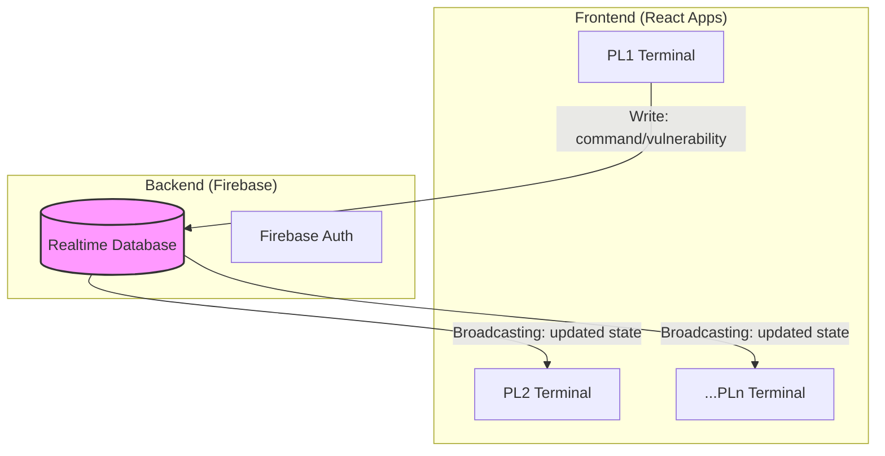
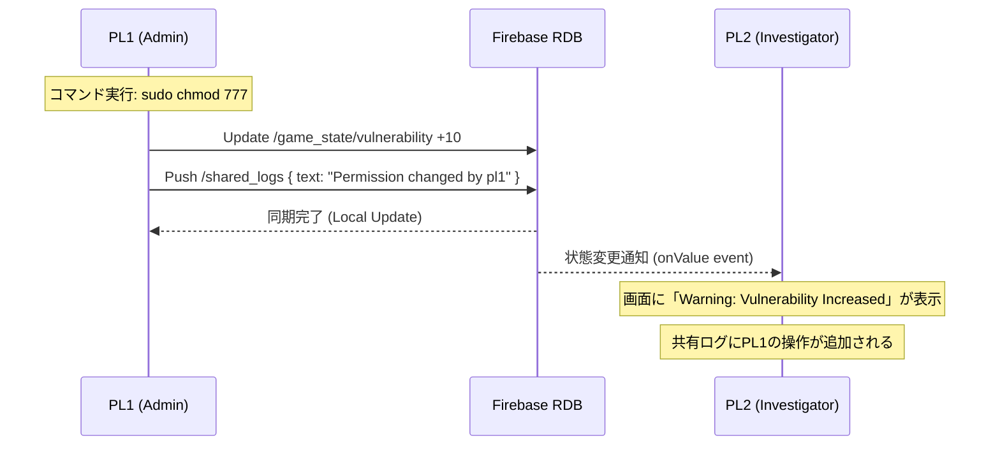

# システムアーキテクチャ：Project: DEEP_SCAN

## 1. 全体構成図 (Architecture Overview)



## 2. データスキーマ (Data Schema)
Firebase Realtime Database 上で保持する共通ステートの構造です。

```json
{
  "game_state": {
    "vulnerability_level": 5,          // 現在の脆弱性（0-100）
    "is_critical_leaked": false,       // 致命的な情報が漏洩したか
    "active_firewall": true            // FWの稼働状態
  },
  "shared_logs": {
    "msg_001": {
      "timestamp": "14:02:10",
      "user": "system",
      "text": "Intrusion detection alert: IP 192.168.x.x",
      "severity": "high"
    }
  },
  "players": {
    "pl1": {
      "role": "Admin",
      "privilege": "root",
      "history": ["ls", "sudo chmod 777 /var/log"]
    },
    "pl2": { "role": "Investigator", "history": ["cat system.log"] }
  }
}
```

## 3. 処理シーケンス (Command Sequence)

あるプレイヤーの行動が全員に波及するまでのフローです。



## 5. コスト分析（無料運用の可否）

結論から言うと、このプロジェクトの規模（数〜数十人の同時プレイ）であれば、**完全に「無料」で運用可能**です。

| サービス             | プラン             | 無料枠の内容                    | 本プロジェクトでの使用量（予測）     |
| :------------------- | :----------------- | :------------------------------ | :----------------------------------- |
| **Firebase**         | Sparkプラン (無料) | 同時接続 100台 / 転送量 10GB/月 | 7台（PL6+GM1）/ 数MB程度             |
| **Vercel / Netlify** | Personal (無料)    | 無制限の帯域 / 月間100GB転送    | 極めて微量（静的ファイルの配信のみ） |
| **React / xterm.js** | オープンソース     | 無制限                          | 0円                                  |

### 懸念点に対する回答
- **「有料プランへの自動移行は？」**: FirebaseのSparkプランは、使い切るとサービスが一時停止するだけで、勝手に課金されることはありません。
- **「将来的に画像などが増えたら？」**: 1GBまでの保存は無料です。テキストベースのパズルなら数千回プレイしても埋まりません。

## 6. 構成のメリット・デメリット
- **State Synchronization**: 
  React の `useEffect` 内で Firebase のリスナーを貼り、DBの値が変わるたびに React のコンポーネントを再レンダリングします。
- **Command Parser**: 
  フロントエンド側に「コマンド解析エンジン」を持ちます。
  `if (command === 'ls') { return getFilesFromDB(); }` のようなシンプルな分岐の集合体になります。
- **Auth**: 
  開始時に「キャラクターコード」を入力させることで、どのPLがどの権限を持っているかを識別します。
